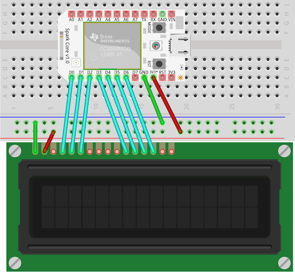
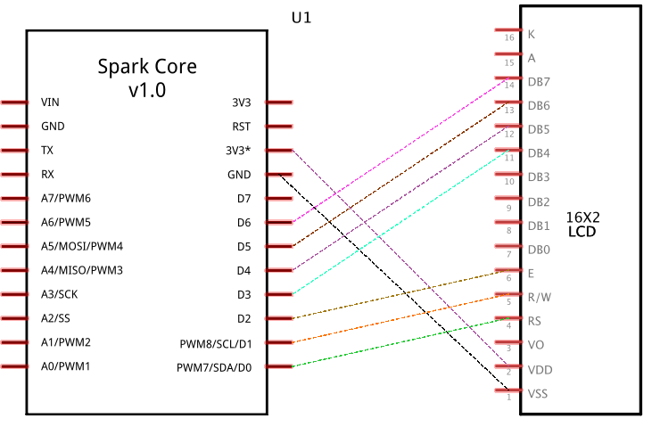

About
===
This software enables you to display the weather, current time and the bus' next departure on a Display. 

This project is a compilation of different components: 

 * Weather from http://openweathermap.org/ (see [the weather documentation](doc/weather.md) for more details)
 * Swiss Traffic Information from http://transport.opendata.ch (running a modified version at http://opentt.herokuapp.com)
 * Time (included in the Spark Core firmware)

**You can remove, add or extract any of the components and create your own project. Share your mix if you like.**

### Hardware
The required hardware is:

 *  Spark Core (https://www.spark.io/)
 *  16x2 OLED Display (http://www.adafruit.com/products/823)
 *  Some wires from ebay
 
The display
===

The colored LED shows when it is the right time to leave and catch a bus. (Green=Good to go, Orange=Run!, Red=too late)

The display shows the time, weather, temperature and next bus departures. The position are configurable in the code. 

## Circuit Diagram
Putting it together is quite simple: 

circuit layout:

in action: 

## Getting started
You have to change some settings in [application.ino](firmware/application.ino), in the method ``setup``. 

First, you have to change some location and API-Key information in the method ``setup``: 

Setup the display acording the your wiring: 

	lcd = new Adafruit_CharacterOLED(OLED_V1, D0, D1, D2, D3, D4, D5, D6);

Set your location (e.g. London,uk) and replace your api key from http://openweathermap.org

    weather = new Weather("Bern,ch", httpClient, "YOUR_OPENWEATHER_API_KEY");

Set your station and adjust the URL (from, to): 

	transport.init(lcd,
			"/v1/connections?from=Wabern,Gurtenbahn&to=Bern&fields[]=connections/from/departure&limit=6",
			httpClient);

## Build and deploy
You must install [spark-cli](https://github.com/spark/spark-cli). 

	cd firmware
	spark  cloud flash 1234567 .

This will build and deploy the source in the spark cloud. (You must replace the device-id `1234567`. )

You can also configure and use the `Makefile`. 

## Used libraries
* [HttpClient](https://github.com/nmattisson/HttpClient) for making http request
* [ArduinoJson](https://github.com/bblanchon/ArduinoJson) for parsing json response from http://openweathermap.org/
* [Adafruit_CharacterOLED](https://github.com/ladyada/Adafruit_CharacterOLED) Arduino for the 16x2 Display, I fixed some imports

Additional Resources
----------------
* This project was inspired by Bastian Widmer (bastianwidmer.ch) and Christian Leu (leumund.ch)
* http://leumund.ch/d-i-y-busstop-lamp-arduino-0011112
* https://github.com/dasrecht/Arduino-Busstop-Light

Licence
----------------
      To the extent possible under law, the person who associated CC0 with
      "spark transport display" has waived all copyright and related or neighboring rights to "spark transport display"
      
      See http://creativecommons.org/publicdomain/zero/1.0/ for a copy of the CC0 legalcode.  